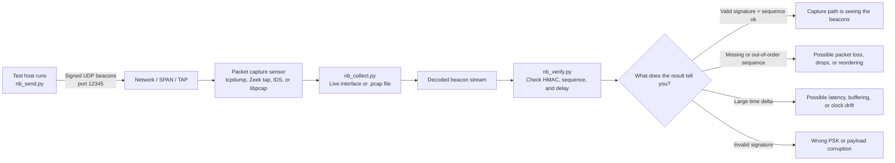

# netbeacon

`netbeacon` is a small toolkit for sending, collecting, and verifying signed UDP beacons so you can validate packet-capture pipelines.

It is useful for checking:

- beacon latency from sender to monitoring system,
- time inconsistencies between capture devices,
- packet loss or reordering, and
- basic watchdog-style health checks for packet capture.

## Python compatibility

The scripts in this repository are compatible with recent Python 3 versions and are written to run on modern CPython releases, including Python 3.10+.

## Packet format

Each UDP payload is an ASCII message with the following structure:

```text
header;epoch;sequence;hmac
```

Field meanings:

- `header`: currently always `nb`
- `epoch`: current Unix epoch timestamp in UTC
- `sequence`: unsigned integer sequence number
- `hmac`: HMAC-SHA1 signature of `header;epoch;sequence;`

By default, packets are sent to UDP port `12345`.

A pre-shared key (PSK) is shared between the sender and verifier to protect packet integrity. The default PSK is `netbeacon`, but you should set your own key in production or shared environments.

### Example messages

```text
nb;1354960619;101;335540bf3dae684c3d5cd5795fd09b9097bad656
nb;1354960619;102;56fc82c066644f179b58eb84a47e577bf92adc47
nb;1354960619;103;854207f54c1c4be97bdf4cd4a0d1068731848698
```

## Requirements

- Python 3.10 or newer recommended
- `dpkt`
- one of the following libpcap Python bindings:
  - `pcap`
  - `python-libpcap` (module name: `pylibpcap`)
- a libpcap-compatible system library for packet capture

Example installation:

```bash
python3 -m pip install dpkt pcap
python3 -m pip install dpkt python-libpcap
```

Depending on your platform, the `pcap` package may require additional system packages such as libpcap development headers.

## Scripts

### `nb_send.py`

Sends netbeacon UDP packets.

```text
Usage: nb_send.py [options]

Options:
  -h, --help            show this help message and exit
  -p PSK, --psk=PSK     pre-shared key used by the HMAC-SHA1 (default: netbeacon)
  -s, --storeseq        store sequence and validate sequence
  -i ITERATION, --iteration=ITERATION
                        set the number of iterations for sending the netbeacon
  -d DESTINATION, --destination=DESTINATION
                        set the destination(s) IPv4 address (default: 127.0.0.1)
  -v, --verbose         output netbeacon sent (legacy alias of --debug-full)
  --debug               light debug output with send summary
  --debug-full          full debug output including per-packet details
```

Example:

```bash
python3 nb_send.py -s -i 3 -d 192.0.2.10 -p mysharedsecret
python3 nb_send.py -i 5 -d 127.0.0.1 --debug
```

### `nb_collect.py`

Reads netbeacon packets from a live interface or a pcap source and writes decoded payloads to stdout.

```text
Usage: nb_collect.py [options]

Options:
  -h, --help            show this help message and exit
  -i INTERFACE, --interface=INTERFACE
                        live capture on interface (default: lo)
  -r FILEDUMP, --read=FILEDUMP
                        read pcap file
  -e, --extended        enable extended format including pcap timestamp
  -m, --monitor         emit periodic live statistics to stderr
  --monitor-interval=MONITOR_INTERVAL
                        seconds between live monitor updates (default: 5)
  --debug               light debug output with capture summary
  --debug-full          full debug output including packet-level details
```

Examples:

```bash
python3 nb_collect.py -i eth0
python3 nb_collect.py -r capture.pcap -e
python3 nb_collect.py -i eth0 -m --monitor-interval 2 --debug
```

### `nb_verify.py`

Verifies signed netbeacon messages from stdin.

```text
Usage: nb_verify.py [options] <netbeacon messages>

Options:
  -h, --help         show this help message and exit
  -t, --timedelta    show timedelta
  -s, --storeseq     store sequence and validate sequence
  -p PSK, --psk=PSK  pre-shared key used by the HMAC-SHA1 (default: netbeacon)
  -m, --monitor      emit periodic live verification stats to stderr
  --monitor-every=MONITOR_EVERY
                     emit live stats every N messages (default: 10)
  --debug            light debug output with final summary
  --debug-full       full debug output including per-message traces
```

Examples:

```bash
python3 nb_send.py -i 1 -v | python3 nb_verify.py
python3 nb_collect.py -i eth0 | python3 nb_verify.py -s -t -p mysharedsecret
python3 nb_collect.py -i eth0 -m --debug | python3 nb_verify.py -m --monitor-every 20 --debug
```

## Use-case overview

A common netbeacon use case is confirming that a packet-capture pipeline is actually seeing the traffic you expect. You can emit signed UDP beacons from a test host, capture them with your sensor or from a saved `.pcap`, and verify that the packets arrive intact, in order, and with an acceptable delay.



### Example: checking whether a pcap pipeline is working

1. Run `nb_send.py` on a host that should traverse the monitored network path.
2. Capture on the sensor interface with `nb_collect.py -i <iface>` or inspect a saved file with `nb_collect.py -r capture.pcap`.
3. Pipe the decoded packets into `nb_verify.py`.
4. Review the output:
   - `valid signature` means the expected signed beacon arrived intact.
   - `Sequence ok` means the capture path is not obviously dropping or reordering the observed beacons.
   - `Time delay` helps estimate how long the beacon took to show up in the capture/analysis path.
   - Missing output usually means the sensor, filter, mirror/SPAN, or `.pcap` file is not seeing the beacon traffic at all.

## Typical workflow

1. Send beacons from a host on the monitored network.
2. Capture the UDP traffic where your monitoring stack can see it.
3. Pipe decoded messages into `nb_verify.py` to validate signatures and sequence continuity.
4. Use `-t` to inspect delay and `-s` to track expected ordering.

## License

`netbeacon` is free software: you can redistribute it and/or modify it under the terms of the GNU General Public License as published by the Free Software Foundation, either version 3 of the License, or (at your option) any later version.

Copyright (c) 2012,2013 Alexandre Dulaunoy - <https://github.com/adulau/>
